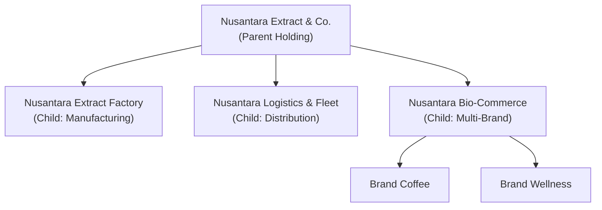
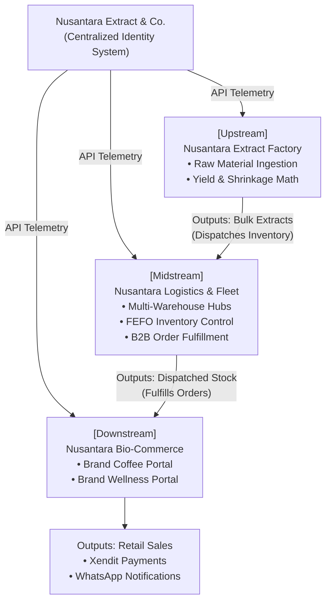
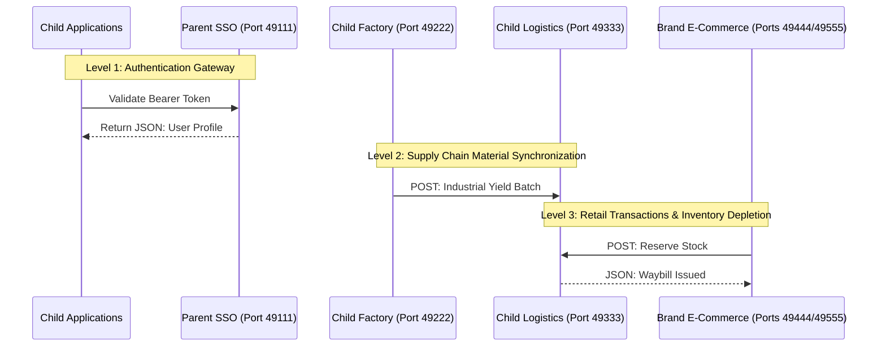
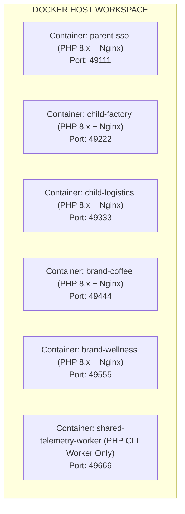

# NEANCO
Nusantara Extract &amp; Co. an Flagship Laravel Project by Me.

# MASTERPLAN: THE NUSANTARA EXTRACT & CO. ENTERPRISE ECOSYSTEM

## Architectural Blueprint for a Multi-App Distributed Monolith

---

## 1. Background

In the contemporary software engineering landscape, demonstrating competency in building high-scale, production-ready systems presents a unique paradox. Engineers who specialize in corporate, enterprise-level systems frequently operate under strict **Non-Disclosure Agreements (NDAs)**. This legal framework confines their most sophisticated work - such as supply chain optimization algorithms, distributed databases, ledger reconciliations, and custom security integrations - behind internal corporate firewalls. Consequently, when communicating with potential high-ticket clients or stakeholder networks, these engineers lack a visible, verifiable body of work that reflects their actual architectural capabilities.

This masterplan outlines the creation of a comprehensive, end-to-end **Flagship Commercial Project**. The core objective of this ecosystem is to serve as an undeniable **Proof of Capability** in commercial system building. By constructing an enterprise-grade holding company infrastructure from scratch, this project removes the limitations of NDA-bound portfolios. It provides a living, fully testable, high-fidelity engineering demonstration.

For potential clients, this system shifts the conversation from abstract theoretical competency to empirical validation. When a developer can successfully demonstrate a multi-app, zero-dependency, distributed network that handles complex enterprise problems - such as raw material extraction shrinkage, multi-warehouse logistics routing, and real-time payment settlement - the psychological barrier to entry drops instantly. The client recognizes that an engineer capable of orchestrating a conglomerate-scale ecosystem can easily build, secure, and scale their specific mid-market or small-and-medium enterprise (SME) applications. This masterplan establishes that professional authority.

---

## 2. Case Study

### 2.1 The Conglomerate Profile: Nusantara Extract & Co.

The entity chosen for this architectural demonstration is **Nusantara Extract & Co.**, a fictional multi-billion-dollar holding company operating within the high-value agricultural extraction, wellness, and agro-industrial processing sectors. The focus on biological assets and natural extraction offers a deeply complex structural workflow, far superseding standard e-commerce or point-of-sale portfolios.



### 2.2 Corporate Subsidiaries

To demonstrate cross-system synergy, the holding company is divided into three distinct operational child corporations:

1. **Nusantara Extract Factory**: The upstream manufacturing arm. This entity manages the procurement of raw botanical materials from regional farmers, logs industrial extraction yields, calculates mass-volume shrinkage, and packages raw oils and concentrates.
2. **Nusantara Logistics & Fleet**: The midstream distribution arm. This entity manages high-volume multi-warehouse storage, implements First-Expired, First-Out (FEFO) inventory algorithms, and handles fleet dispatching and B2B delivery tracking.
3. **Nusantara Bio-Commerce**: The downstream retail and consumer-facing engine. This entity manages direct-to-consumer sales via distinct, highly tailored brands.

### 2.3 Comprehensive Legal & Creative Disclaimer

> **Portfolio Sample Disclaimer:**
> All corporate names, subsidiary titles, brand identities, logos, transactional data, domain configurations, and business operational structures utilized within this project are entirely **dummy data and fictional constructs** generated solely for portfolio sampling, structural demonstration, and educational purposes.
> In the global digital economy, identifying entirely unique, unregistered trade names has reached a point of saturation due to the sheer volume of active corporations. Therefore, any resemblance or structural similarity to real-world corporate entities, existing brands, operational businesses, or registered trademarks is completely coincidental and unintentional. This project does not seek to compete with, infringe upon, or misrepresent any real-world enterprise or market participant. It is a closed, sandboxed engineering simulation designed to demonstrate backend and frontend system design capabilities.

---

## 3. System Architecture (Non-Technical)

The core strength of the Nusantara Extract & Co. ecosystem lies in its **structural synergy**. Rather than treating each application as an isolated unit, the network mimics a real-world conglomerate where the output of one company serves as the operational input for the next.



### 3.1 Upstream: Manufacturing & Extraction Value Chain

The ecosystem begins at the **Nusantara Extract Factory**. This application models the intake of raw biological assets (e.g., raw vetiver roots, raw patchouli leaves, unroasted premium coffee cherries).

* **The Procurement Phase**: Factory operators log shipments arriving from agricultural cooperatives. The system tracks raw weight, moisture levels, and cost of acquisition.
* **The Transformation Phase**: The raw materials undergo industrial processing simulation (distillation, extraction, or roasting). Here, the system executes complex mass-balance calculations. For example, when processing raw patchouli leaves into patchouli essential oil, the system records the exact raw material mass input versus the refined liquid output, generating an automated report on processing efficiency and material shrinkage.
* **The Inventory Packaging Phase**: The finalized premium concentrates are assigned unique tracking parameters, packaged into standardized bulk industrial containers, and prepared for handover to the logistics division.

### 3.2 Midstream: Logistics, Multi-Warehouse, and B2B Dispatch

Once products are marked as "Refined and Packaged" at the factory, ownership transitions to **Nusantara Logistics & Fleet**. This application serves as the operational spine of the conglomerate.

* **Multi-Warehouse Aggregation**: The logistics app maintains a real-time ledger of multiple regional distribution centers (e.g., Central Sumatra Warehouse, West Java Fulfillment Hub). It handles stock placement based on geographical demand parameters.
* **Intelligent Inventory Control**: Because agricultural extracts degrade over time, the system enforces strict compliance with the **First-Expired, First-Out (FEFO)** protocol. Stock is categorized by batch-specific expiration metrics. When down-stream orders arrive, the system automatically allocates inventory from the oldest viable batches, minimizing spoilage.
* **Fleet Coordination**: This module handles vehicle utilization, tracking driver assignments, truck capacities, and generating secure digital B2B Manifests and Waybills.

### 3.3 Downstream: Omnichannel Bio-Commerce & Retail Sub-Brands

The final phase of the value chain is handled by **Nusantara Bio-Commerce**. This entity acts as a multi-tenant retail engine that splits into distinct, highly specialized consumer brands:

* **Brand A (Nusantara Coffee)**: A premium lifestyle brand focused on single-origin processed coffees. The customer experience is rich, deeply visual, and consumer-centric, utilizing dark, organic earthy tones.
* **Brand B (Atsiri Wellness)**: A high-end clinical and therapeutic brand selling premium essential oils. The user interface is stark, minimal, clean, and medical-grade, utilizing soft greens and sterile whites.

Both brands maintain isolated front-end customer experiences but route all transactional telemetry back to the centralized logistics engine for real-time order fulfillment.

---

## 4. Folder Architecture

The entire ecosystem is structured as a **Distributed Workspace** contained within a single main directory on the engineer's operating system. Each system runs as a completely isolated application, maintaining its own codebase, configuration layout, and database layer.

```text
nusantara-group-ecosystem/              # Root Development Workspace
│
├── .env.example                        # Universal environment blueprint and port matrix
├── README.md                           # Master structural documentation and orchestration guide
│
├── 1. parent-sso/                      # [LARAVEL 1] Core Holding Identity Server
│   ├── app/                            # Core application logic
│   ├── config/                         # Configuration manifests
│   ├── database/                       # Migrations for db_nusantara_parent
│   │   └── migrations/
│   ├── public/                         # Public-facing assets
│   │   ├── css/                        # Native structural holding CSS modules
│   │   └── js/                         # Native SSO JavaScript handshakes
│   └── routes/
│       ├── api.php                     # Tokens validation endpoints for child apps
│       └── web.php                     # Executive Holding Dashboard (Filament interface)
│
├── 2. child-factory/                   # [LARAVEL 2] Upstream Manufacturing Core
│   ├── app/                            # Manufacturing, extraction, and yield logic
│   ├── database/                       # Migrations for db_nusantara_factory
│   ├── public/
│   │   ├── css/                        # Industrial UI CSS architecture
│   │   └── js/                         # Raw calculation/DOM manipulators
│   └── routes/
│       ├── api.php                     # Yield synchronization APIs
│       └── web.php                     # Factory ingestion control panels
│
├── 3. child-logistics/                 # [LARAVEL 3] Midstream Fulfillment Spine
│   ├── app/                            # FEFO engines, multi-warehouse ledgers, fleet routing
│   ├── database/                       # Migrations for db_nusantara_logistics
│   ├── public/
│   │   ├── css/                        # Logistics & tracking UI CSS modules
│   │   └── js/                         # Maps/tracking simulators via raw JS
│   └── routes/
│       ├── api.php                     # Global Stock Deductions & Waybill APIs
│       └── web.php                     # Fulfillment control center
│
└── 4. child-commerce/                  # [LARAVEL 4] Retail Commerce Orchestrator
    ├── README.md                       # Sub-workspace installation guide
    │
    ├── brand-coffee/                   # [LARAVEL 4A] Consumer Facing Premium Coffee App
    │   ├── app/                        # Cart logic, local session states
    │   ├── database/                   # Migrations for db_commerce_coffee
    │   ├── public/
    │   │   ├── css/                    # Earthy, dark luxury aesthetic CSS modules
    │   │   └── js/                     # Raw vanilla AJAX cart operations
    │   └── routes/
    │       ├── api.php                 # Webhooks processing (Xendit incoming)
    │       └── web.php                 # Customer catalog and checkout flows
    │
    └── brand-wellness/                 # [LARAVEL 4B] Consumer Facing Essential Oil App
        ├── app/                        # Medical-grade procurement handlers
        ├── database/                   # Migrations for db_commerce_wellness
        ├── public/
        │   ├── css/                    # Clean, minimal clinical aesthetic CSS modules
        │   └── js/                     # Modular payment handlers
        └── routes/
            ├── api.php                 # Telemetry interfaces
            └── web.php                 # Clinical product indexes

```

---

## 5. Technical Flow

The interactions across the Nusantara Extract & Co. network are managed through decoupled, secure API calls. Because the system runs without heavy JavaScript frameworks or external microservice event buses, the applications communicate via secure synchronous REST APIs and asynchronous webhooks using Laravel’s native HTTP Client.

### 5.1 Multi-Level API Communication Topography



### 5.2 Deep Dive: Functional Technical Flows

#### Level 1: Cross-App Centralized Authentication (Single Sign-On Handshake)

When an internal corporate employee accesses any child app dashboard (e.g., the Logistics Hub), the system delegates identity verification to `parent-sso`.

1. The user arrives at `child-logistics` and clicks "Login via Nusantara Account".
2. `child-logistics` redirects the user's browser to `parent-sso` (Port 49111) with an application identifier.
3. The user authenticates on `parent-sso` using standard secure session cookies.
4. `parent-sso` generates a single-use authorization code and redirects back to `child-logistics`.
5. `child-logistics` intercepts this code in the background via a server-to-server request, calling the `parent-sso` API to exchange the code for a secure access token.
6. `parent-sso` processes the verification and returns a payload:

```json
{
  "status": "success",
  "user": {
    "uuid": "usr_99a8b7c6",
    "name": "This Is User",
    "email": "user@nusantaraextract.id",
    "global_role": "executive_holding",
    "subsidiary_access": ["factory_01", "logistics_main", "commerce_all"]
  }
}

```

#### Level 2: Upstream-to-Midstream Supply Chain Handover

When an extraction run completes at the factory, the inventory must instantly populate the logistics ledger.

1. The factory operator finalizes a patchouli extraction batch within `child-factory`.
2. The application calculates the raw-to-oil yield ratio and processes the batch closing.
3. `child-factory` builds a secure outbound JSON payload and transmits it via HTTP POST to `child-logistics` (Port 49333) using an authorized system API key.

| Endpoint | Method | Payload Parameters | Expected Success Response |
| --- | --- | --- | --- |
| `/api/v1/inventory/ingest-batch` | `POST` | `factory_id`, `sku`, `batch_number`, `quantity_liters`, `extraction_date`, `expiry_date` | `201 Created` with unique `warehouse_ledger_id` |

4. `child-logistics` validates the API key, provisions storage allocation inside its database schema, and schedules the FEFO tracking queues.

#### Level 3: Retail Omnichannel Checkout & Real-Time Stock Reservation

When a customer purchases an essential oil bottle via the `brand-wellness` public storefront, the transaction must execute synchronous cross-app inventory verification.

1. The consumer completes checkout via the web interface on `brand-wellness` (Port 49555) using a simulated **Xendit Payment Gateway** webhook.
2. `brand-wellness` instantly triggers a background HTTP request to `child-logistics` (Port 49333) to claim the physical inventory.
3. The `child-logistics` engine searches the local multi-warehouse database. It executes a FEFO query:

$$\text{SELECT } \text{batch\_id} \text{ FROM } \text{inventory} \text{ WHERE } \text{sku} = X \text{ AND } \text{expiry\_date} > \text{NOW()} \text{ ORDER BY } \text{expiry\_date} \text{ ASC}$$

4. If stock is available, `child-logistics` deducts the requested inventory amount, reserves the items, creates an internal dispatch ticket, and responds to `brand-wellness`:

```json
{
  "reservation_status": "confirmed",
  "tracking_number": "NT-LOG-20260529-001",
  "dispatched_from_hub": "WH-WEST-JAVA-02",
  "fefo_batch_allocated": "BATCH-2026-NILAM-04"
}

```

5. `brand-wellness` captures this tracking data, triggers a local database write to mark the order as processed, and communicates the confirmation to the customer.

---

## 6. Tech Stack & Technical Composition

The operational constraint of this ecosystem is **absolute dependency minimization**. By avoiding complex front-end frameworks, compiling steps, and large external package systems, the project emphasizes pure backend architecture and native software design.

### 6.1 The Core Runtime Stack

* **Core Framework**: **Laravel 13 (Native PHP)**. The system utilizes the latest native core framework architectures, emphasizing clean route files, controller structures, and raw Eloquent database transactions.
* **Front-End Engine**: **Pure Blade Templates**. The user interfaces are served directly by the server via Laravel's native templating component.
* **Styling Strategy**: **Modular Vanilla CSS**. No preprocessors (SASS/LESS) and no utility frameworks (Tailwind npm installations) are used within the core application directory. Styling is handled via highly structured, independent CSS modules saved in the public directory and structured as follows:

```css
/* public/css/components/enterprise-table.css */
.ent-table-container {
    width: 100%;
    border-collapse: collapse;
    margin: 1.5rem 0;
    font-family: 'Inter', sans-serif;
}
.ent-table-header {
    background-color: #1e293b;
    color: #ffffff;
    text-align: left;
    padding: 0.75rem;
}

```

* **Client Behavior**: **Modular Vanilla JavaScript**. Interactivity (such as updating cart items, processing modals, and sorting datatables) is handled via clean, modern ECMAScript (Vanilla JS) using native `fetch()` functions for asynchronous AJAX communications. No Node.js runtimes, no `package.json` configurations, and zero JavaScript build pipelines exist in the repositories.

### 6.2 Zero-Dependency Package Whitelist

To demonstrate pure software engineering mastery, the installation of third-party packages via Composer is prohibited, except for foundational utilities that would be counterproductive to build completely from scratch:

1. `simplesoftwareio/simple-qrcode`: Used inside `child-logistics` to output native SVG QR codes for scanning verification.
2. `barryvdh/laravel-dompdf`: Used to stream standardized PDF files for packing slips and commercial invoices directly from raw HTML layouts.
3. Laravel Native Core Componentry: Full reliance on built-in capabilities, specifically `Illuminate\Support\Facades\Http` (Guzzle abstraction), Eloquent ORM, and the native validation engine.

### 6.3 Isolated Container Infrastructure (Docker Port Matrix)

To ensure smooth concurrent execution on standard developer hardware without resource strain, the entire network is containerized using decoupled, lightweight Docker configurations. Each application runs within an isolated environment containing a dedicated PHP-FPM runtime and an Nginx instance.



The system maps structural ports to prevent network overlaps, configured via the following centralized specification matrix:

| Application Module | Docker Container Identifier | Exposed Host Port | Core Data Store (MySQL) |
| --- | --- | --- | --- |
| **Parent Central Hub** | `nusantara-parent-sso` | `49111` | `db_nusantara_parent` |
| **Upstream Manufacturing** | `nusantara-child-factory` | `49222` | `db_nusantara_factory` |
| **Midstream Distribution** | `nusantara-child-logistics` | `49333` | `db_nusantara_logistics` |
| **Downstream Retail: Coffee** | `nusantara-brand-coffee` | `49444` | `db_commerce_coffee` |
| **Downstream Retail: Wellness** | `nusantara-brand-wellness` | `49555` | `db_commerce_wellness` |
| **Telemetry System Worker** | `nusantara-worker-hub` | `49666` | *Shares Logistics Log Cache* |

---

## 7. Resume & Summary

The **Nusantara Extract & Co.** Masterplan establishes a highly intentional, architecturally complex portfolio strategy designed to bypass the constraints of NDA-bound professional work. By choosing an agro-industrial, biodiversity-focused holding company case study, the ecosystem avoids the simplistic patterns of generic portfolio examples. Instead, it challenges the engineer to solve genuine, high-value business logic problems across multiple independent system layers.

### Summary of System Specifications

* **Architectural Pattern**: Distributed Monolith utilizing a secure server-to-server API architecture.
* **Core Tech Constraints**: Laravel 13 running on pure PHP, using native Blade templates, modular vanilla CSS, and vanilla JS. It features a complete **No-Node.js** architecture, ensuring it remains extremely lightweight and fast to develop.
* **Operational Synergy**: Full integration from upstream raw manufacturing and shrinkage tracking to midstream FEFO logistics management, culminating in downstream multi-tenant e-commerce retail engines.
* **Infrastructure Layout**: Fully containerized Docker platform running 6 isolated services across fixed ports (`49111` - `49666`).

This project serves as a definitive showcase of engineering excellence. It shifts the developer's professional standing from a standard application coder to a comprehensive **Enterprise Solutions Architect**. This system provides a tangible, high-performance proof of capability that builds immediate trust and authority with high-ticket clients.
